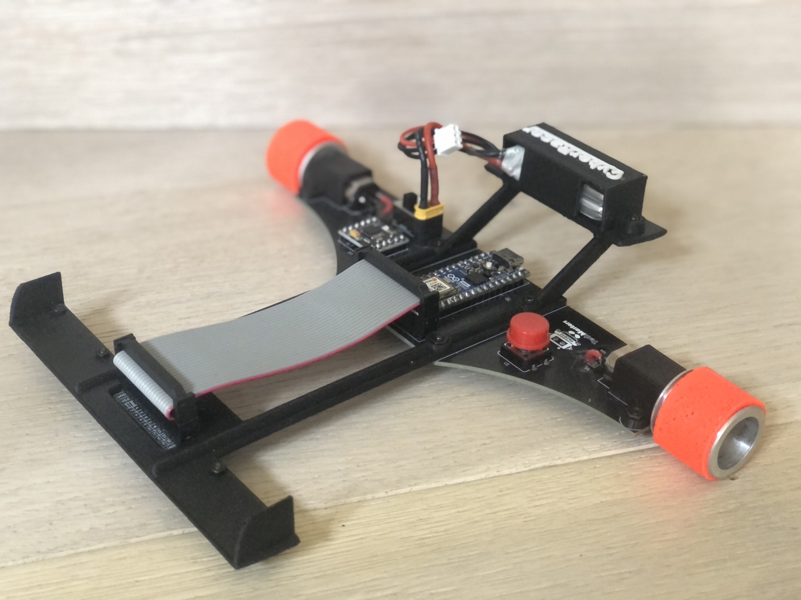
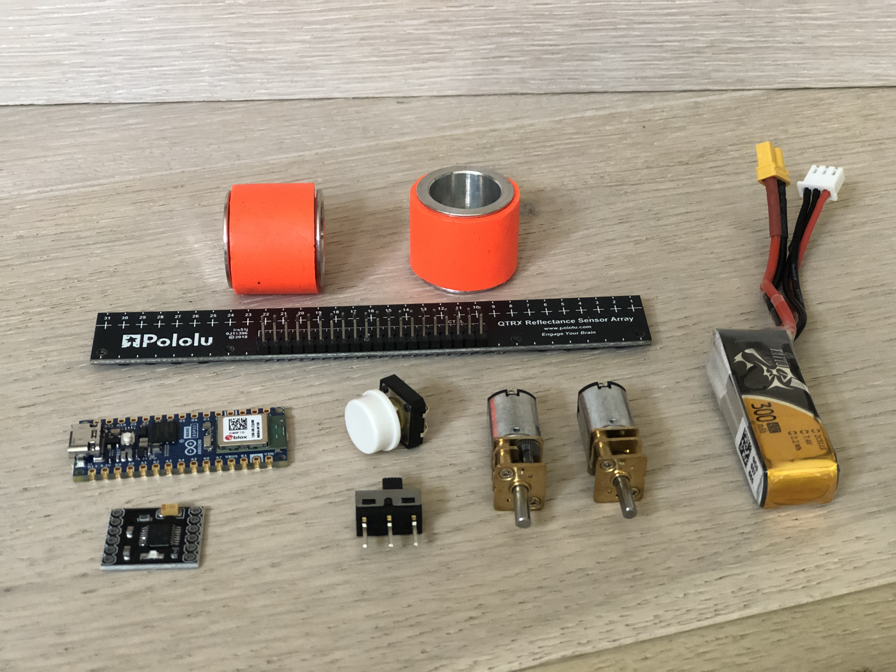
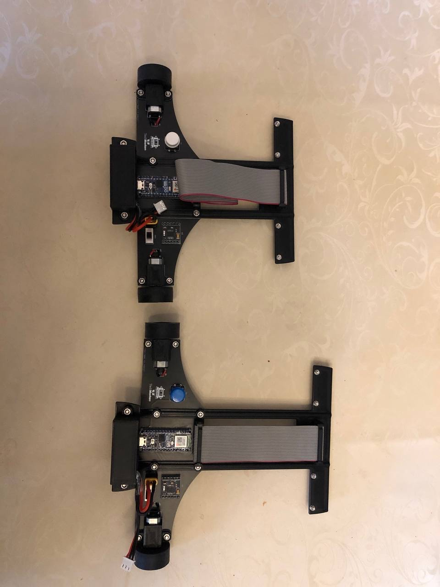
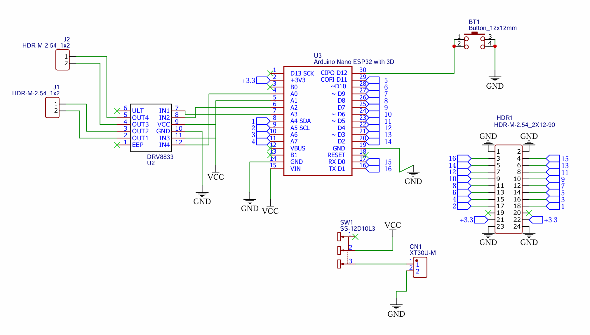
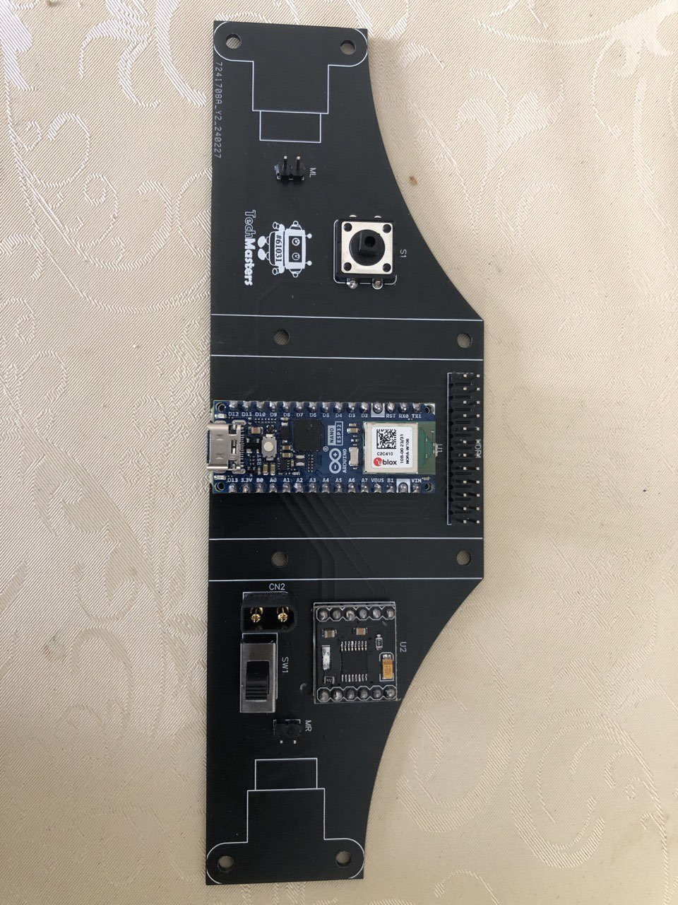

# __Line Follower Robot__

This autonomous line follower robot was created for the RoboGames Olympics 2024 by me and my younger brother. It has been designed, modeled, constructed and programmed from scratch. The robot can autonomously follow a black or white line on a contrasting background at high speeds by implementing a PID controller.

### 3D Design

The bracket and other components of the robot body were designed in Autodesk Fusion 360. They were then sliced in Ultimaker Cuda and 3d printed, first out of plastic and finally from carbon fiber. The main frame was designed to be easily replaceable to test varying robot lengths and multiple prototypes were tried before arriving at the final design.

After early testing, it was evident that standard rubber wheels were too slippery and hindered the robot's accuracy especially on sharp turns. To solve this issue, the wheels were upgraded to special JSumo non-slip aluminum silicone wheels that greatly increase the robot's friction with the track.

### Electronics Design

The robot uses an Arduino Nano ESP32 Microcontroller, a DRV8833 Motor Drive Module, and a 16 channel Pololu QTR Reflectance Sensor Array. These components are mounted on a custom 2-sided PCB Board that was designed and manufactured with EasyEDA. The two 6V 1000RPM Pololu Micro Metal Gear Motors are powered by a rechargeable Lithium Polymer battery pack.

A stand-alone stopwatch device was also created for measuring the lap time of the robot.

### Software Design

Since the robot needs to keep the line sensor centered on the line while experiencing external changes, the PID controller algorithm was chosen for this task. In this scenario the target setpoint is the line position detected by the sensor, set to be held in the middle. The process affected by the outputs is the turning of the motors.

Each of the PID modules requires a coefficient, which is fine tuned by hand to optimally fit a given track. To expedite this process, a simple mobile application was created with MIT App Inventor which uses the Bluetooth Low Energy (BLE) technology to communicate with the Arduino microcontroller. This allows the coefficients to be quickly tweaked while observing the results in real time. When the desired coefficients are reached, they are serialized with the Arduino Preferences library.

### Result Videos

https://github.com/user-attachments/assets/4bbc2604-2ac1-476d-a4cd-80716923511e

### Future Improvements
A major improvement that could be made to the robot design is adding a turbine to improve the robot's friction.
The stopwatch device could be improved by letting it also connect to a mobile app and calculate the average lap time.
Multiple coefficient profiles could be added to support easy switching between tracks and frame lengths.
